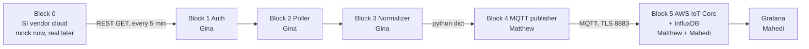
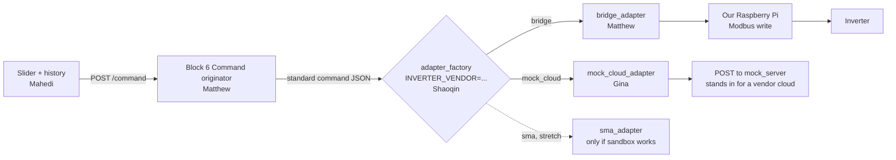

# C2C Pipeline Build Guide

2026-09-20 · Shaoqin Li

One pipeline, two directions. **Pull** (Blocks 0–5) reads any vendor's Smart Inverter (SI) cloud into our DERMS. **Push** (Block 6 + adapters) sends a command back. Only two files change per vendor, so we finish the pipeline first and buy the inverter after. Everything is due **2026-12-20**. Nothing in this guide waits on the professor's inverter decision.

## Where we are on 2026-09-20

- **Built:** Block 0 mock server, 58 tests passing (52 mock + 6 repo health), CI green. Repo: [github.com/sqlhhh/vpp-c2c](https://github.com/sqlhhh/vpp-c2c) (private).
- **Not built:** Blocks 1–6, every adapter, the dashboard. Nobody except Shaoqin has cloned the repo yet — that is everyone's Step 0.
- **Authoritative specs:** `docs/block0_contract.md` (what the mock returns — real captured JSON) and `docs/team1_contract.md` §4 (the 11-field schema we publish). Where the old context skill disagrees with these, the contracts win.

## The pull pipeline (Blocks 0–5)

Swapping vendor changes Block 0's URL (three lines in `.env`) and Block 3's field-mapping table. Blocks 1, 2, 4, 5 never change. Note the MQTT link is Block 4 → Block 5; Block 3 → Block 4 is an in-process Python dict.

## The push pipeline (Block 6 + adapters)

**Why exactly two adapters.** "Any brand fits" is proven by flipping one setting and watching the same command land two different ways. The market has two shapes: **local write** (SolarEdge, Fronius, Deye, Growatt, Sol-Ark, any SunSpec inverter — our Pi writes a Modbus register) and **vendor-cloud push** (SMA, Victron, Enphase — the vendor's cloud accepts the command, their box executes it). The Bridge adapter is shape 1 against a mocked register table. The mock-cloud adapter is shape 2 against a `POST` endpoint we add to our own mock server — the same trick Block 0 already uses for pull. SMA's real sandbox is a **stretch**: Ali requests credentials now; someone codes it only if credentials arrive and GridControl is confirmed to work there. Victron stays a stub file so the slot is visible.

## Who owns what

| Person | Lane | Files | Waiting on |
| --- | --- | --- | --- |
| Shaoqin | Contracts, repo, integration | `docs/command_contract.md`, `src/adapter.py`, `src/adapter_factory.py` | nobody |
| Gina | REST (pull + mock-cloud push) | `src/auth.py`, `src/poller.py`, `src/normalizer.py`, `src/mock_cloud_adapter.py` + tests | nobody — `block0_contract.md` is done |
| Matthew | MQTT (publisher, broker, originator, Pi bridge) | `src/mqtt_publisher.py`, `src/mqtt_to_influx.py`, `src/command_originator.py`, `src/bridge_adapter.py`, `pi/bridge.py` | `command_contract.md` (week 1), Ali's register map (week 7) |
| Mahedi | Database + dashboard | InfluxDB bucket, Grafana dashboard JSON, command page | Matthew's IoT Rule (week 3), originator (week 8) |
| Ali | Data files, verification, evidence, demo | `docs/setup.md`, `register_maps/solaredge.json`, SMA request, `docs/evidence/` | nobody |

## Schedule, counted back from Dec 20

| Week | Dates | Milestone |
| --- | --- | --- |
| 1–2 | Sep 21 – Oct 4 | Everyone: Phase 0 closed (clone + 58 tests). Shaoqin: contracts + adapter interface. Gina: `auth.py`, `poller.py`. Matthew: publisher on local Mosquitto, AWS IoT Thing. Mahedi: InfluxDB up, fake rows written. Ali: setup.md, SMA email sent |
| 3–4 | Oct 5 – 18 | Gina: `normalizer.py` + tests. Matthew: IoT Rule → InfluxDB. Mahedi: 6 panels on real pipeline data |
| 5–6 | Oct 19 – Nov 1 | **Pull soak: 60 min unattended, no manual intervention** — the primary grade gate. Ali logs evidence |
| 7–9 | Nov 2 – 22 | Push: originator, Pi bridge vs mock registers, mock-cloud adapter, slider + history panel |
| 10 | Nov 23 – 29 | **Swap demo:** flip `INVERTER_VENDOR`, same command lands both ways. Ali logs evidence |
| 11–13 | Nov 30 – Dec 20 | Report, slides, defense. Ali leads the demo |

## What changes when the real inverter arrives

| If the purchase is | Pull side | Push side |
| --- | --- | --- |
| SolarEdge or Fronius (local Modbus shape) | 3 lines in `.env`; Block 3 map already matches SolarEdge | `bridge_adapter`: replace the mock register table with `pymodbus` TCP to the inverter (SolarEdge port 1502). Same code |
| SMA, Victron or Enphase (cloud-push shape) | 3 lines in `.env` + a new Block 3 map | one new adapter shaped like `mock_cloud_adapter.py`, against the vendor's real API |

In both cases Blocks 1, 2, 4, 5, 6, the dashboard and the command schema do not change. Any real write to a grid-tied inverter also needs the safety gate in `command_contract.md` and lab-tech sign-off first.

## Your tab

Open your own tab and start at Step 0. Every tab has the same shape: Step 0 → your files → a worked example with real data → "done when" (the command that proves it) → who is waiting on you → dates.

- Shaoqin — PM: contracts, interface, gates
- Ali — Setup, data files, evidence, demo
- Gina — REST: auth, poller, normalizer, mock-cloud push
- Matthew — MQTT: publisher, broker, originator, Pi bridge
- Mahedi — InfluxDB, Grafana, command page

This guide replaces the Team Handbook (Sep 3) and the Explainer (Jul 11) for task assignments. Read those only for background.
