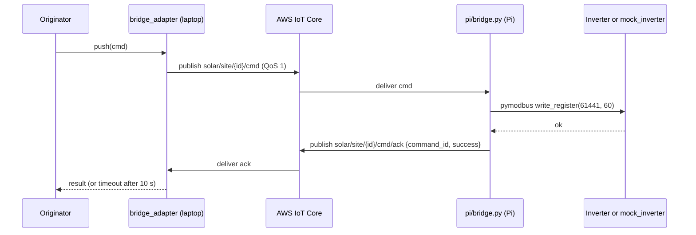

# Matthew — MQTT lane: publisher, broker, originator, Pi bridge

You own everything that talks MQTT: publishing telemetry up to the broker (Blocks 4–5), and in weeks 7–9 the command path back down — the originator, and the Raspberry Pi bridge that turns an MQTT command into a Modbus write. You need none of Gina's code to start: the message shape is already fixed in `docs/team1_contract.md` §4, so use that JSON as fake data until week 3.

## Step 0 · today

Clone [github.com/sqlhhh/vpp-c2c](https://github.com/sqlhhh/vpp-c2c), venv, `pip install -r requirements.txt`, `cp .env.example .env`, `pytest tests/ -v` → `58 passed`. Install [Mosquitto](https://mosquitto.org/download/) locally for development; the demo never uses it. Branch per task, PR to `main`, green CI.

## Task 1 — `src/mqtt_publisher.py` (Block 4) · by 2026-10-04

One message per poll, one topic, the whole record. This follows `team1_contract.md`, which supersedes the old per-field topic list.

| Setting | Value |
| --- | --- |
| Library | `paho-mqtt` |
| Topic | `solar/site/{site_id}/telemetry` (root from `MQTT_TOPIC_ROOT`) |
| Payload | `json.dumps(record)` — the 11-field dict from `normalize()`, unchanged |
| QoS / retain | QoS **1**, retain **false** |
| Last will | on `solar/site/{site_id}/status`: `{"online": false}`; publish `{"online": true}` on connect |
| Modes | `MQTT_MODE=local` → `localhost:1883` no TLS; `MQTT_MODE=aws` → `AWS_IOT_ENDPOINT:8883`, TLS 1.2 with the three cert paths in `.env`; `thingspeak` → hot standby, week 6 |
| Reconnect | on disconnect wait 5 s, then 10, 20, 40, cap 60; keepalive 60 s |
| Failure | logged, never raised — one uncaught exception ends the 60-minute soak |

**Worked example:** with Mosquitto running and this fake record from the contract:

```json
{"site_id": "demo_site_001", "data_source": "mock", "utc_timestamp": "2026-09-08T18:56:17Z",
 "stale": false, "solar_power_w": 4191.0, "battery_power_w": 3698.0, "battery_soc_pct": 55.0,
 "grid_power_w": 0.0, "load_power_w": 493.0, "energy_today_kwh": 27.7, "energy_lifetime_kwh": 12477.7}
```

`python -c "from mqtt_publisher import publish; publish(RECORD)"` makes `mosquitto_sub -t 'solar/#' -v` print `solar/site/demo_site_001/telemetry {"site_id": ...}` and the `on_publish` log line shows the message id.

**Done when:** `pytest tests/test_mqtt_publisher.py` passes with the client patched: correct topic, QoS 1, retain false, LWT set, a publish failure logs and returns `False` without raising; and the `mosquitto_sub` line above shows the message.

## Task 2 — AWS IoT Core + `src/mqtt_to_influx.py` (Block 5, broker half) · by 2026-10-18

1. AWS free tier account (250,000 messages/month; we send about 4,000). Create an IoT **Thing** `vpp-team2`, download the device cert, private key and `AmazonRootCA1.pem` into `certs/` (git-ignored; check `git status` shows nothing from `certs/`).
2. Policy: allow `iot:Connect`, `iot:Publish`, `iot:Subscribe`, `iot:Receive` on `solar/*` only. Create a second Thing + policy scoped to `gateway/*` for Team 1 and hand it to Shaoqin.
3. `MQTT_MODE=aws` in `.env`; the AWS console **MQTT test client** subscribed to `solar/#` shows the fake record.
4. `src/mqtt_to_influx.py`: a subscriber on `solar/+/+/telemetry` that writes each message to InfluxDB (Mahedi's bucket `solar_data`, org `vpp`) as measurement `telemetry`, tags `site_id`, `data_source`, `stale`, fields = the seven numbers, time = `utc_timestamp`. This runs on the laptop; an AWS IoT Rule to a hosted Influx is the stretch, not the plan.

**Done when:** publish the fake record with `MQTT_MODE=aws` and this returns one row: `influx query 'from(bucket:"solar_data") |> range(start:-1h) |> filter(fn:(r)=> r._measurement=="telemetry")'`.

## Task 3 — `src/command_originator.py` (Block 6) · by 2026-11-08

The one place a command enters the system. Mahedi's page calls it; it never talks to a vendor, only to `adapter_factory.get_adapter()`. Read `docs/command_contract.md` first — the safety gate lives here.

| Part | Detail |
| --- | --- |
| Endpoint | Flask on port 5001: `POST /command` body `{"command": "set_power_limit_pct", "value": 60}` |
| Validate | command in the whitelist, value integer 0–100; otherwise `400` and nothing else happens |
| Stamp | add `command_id` (uuid4), `site_id`, `requested_at` (UTC), `dry_run` (from `DRY_RUN`, default `1`) |
| Dry run | `DRY_RUN=1`: log it, write it to Influx with `detail: "dry_run"`, return `success: true`, **do not call `push()`** |
| Execute | `DRY_RUN=0`: `result = get_adapter().push(cmd)`; write `cmd` + `result` to Influx measurement `commands` (tags `adapter`, `success`; fields `command`, `value`, `detail`) |
| Respond | the result JSON from `command_contract.md` |
| History | `GET /commands?limit=20` returns the last rows from that measurement for Mahedi's table |

**Done when:** `curl -X POST localhost:5001/command -H 'Content-Type: application/json' -d '{"command":"set_power_limit_pct","value":60}'` returns `{"success": true, "adapter": "mock_cloud", ...}`, one row appears in `commands`, and `value: 150` returns `400`. `pytest tests/test_command_originator.py` covers whitelist, clamp, dry-run-does-not-push (adapter patched).

## Task 4 — The bridge: `src/bridge_adapter.py` + `pi/bridge.py` + `pi/mock_inverter.py` · by 2026-11-22

Adapter shape 1: our own Pi writes a Modbus register. Until the Pi and inverter exist, `pi/mock_inverter.py` is a `pymodbus` server on your laptop holding Ali's register table. The same `pi/bridge.py` later runs on the real Pi with the IP changed.



| File | What it does |
| --- | --- |
| `pi/mock_inverter.py` | `pymodbus` TCP server on `localhost:1502`, holding registers loaded from `register_maps/solaredge.json` (Ali, week 3–6). Prints every write |
| `pi/bridge.py` | subscribes to `solar/site/{site_id}/cmd`; on a message looks up `active_power_limit_pct` in the register map; if `advanced_power_control_enable` is 0 writes 1 there first; writes `value`; reads it back; publishes the ack. Refuses any command not in the map |
| `src/bridge_adapter.py` | `BridgeAdapter(InverterAdapter)`: `push()` publishes the command, waits up to 10 s for the ack with the same `command_id`, returns the result; `pull()` returns the latest normalized record (reuse Gina's `normalize(*poll_once())`) |

**Worked example:** with `mock_inverter.py`, `bridge.py` and Mosquitto running, `INVERTER_VENDOR=bridge DRY_RUN=0`, the `curl` from Task 3 makes `mock_inverter.py` print `write 61441 <- 60`, and `mbpoll` / a `pymodbus` read of 61441 returns 60. The ack row lands in `commands` with `adapter: "bridge"`.

**Done when:** `pytest tests/test_bridge_adapter.py` passes: a push writes the register and the read-back is the new value; a command with no ack within 10 s returns `success: false`; an unknown command is refused on the Pi side. And the swap test: the same `curl` with `INVERTER_VENDOR=mock_cloud` then `=bridge`, both `success: true`.

**Hardware for the real Pi** (Shaoqin is asking for it): Raspberry Pi 4 (4 GB), USB-RS485 adapter, 5 V 3 A supply. SolarEdge Modbus TCP is on port **1502**, RS-485 on **port 2**. No write to a real inverter without the lab-tech sign-off in `command_contract.md`.

## Who is waiting on you

| Who | For | When |
| --- | --- | --- |
| Mahedi | rows in InfluxDB (Task 2) | week 3 |
| Mahedi | `POST /command` and `GET /commands` (Task 3) | week 8 |
| Shaoqin | swap demo (Task 4) | week 10 |
| Team 1 | their AWS Thing + `gateway/*` policy (Task 2 step 2) | when they ask |

You wait on Shaoqin for `command_contract.md` + `adapter.py` (week 1) and on Ali for `register_maps/solaredge.json` (week 6). Until then `mock_inverter.py` can hold the three expected addresses from Ali's tab.
